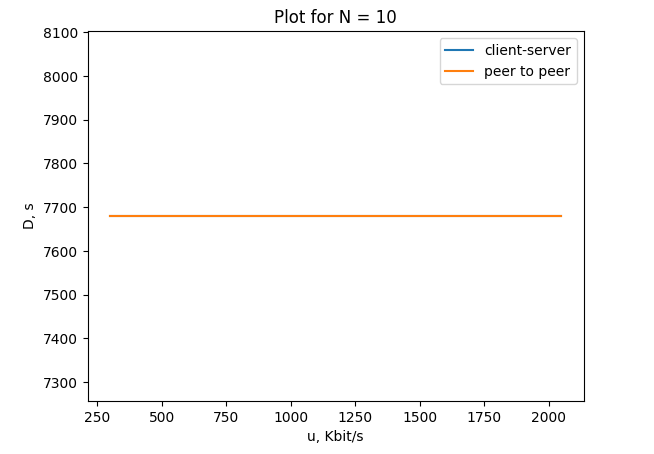
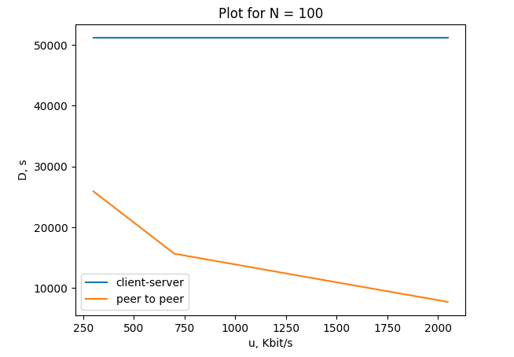
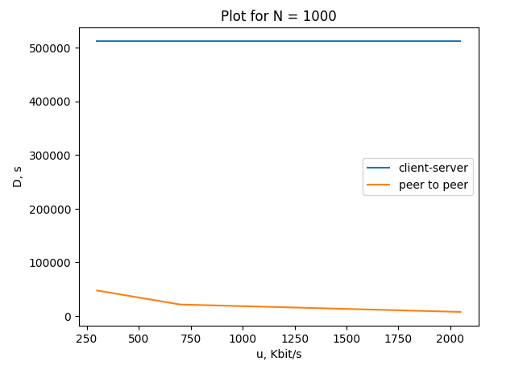

# Практика 5. Прикладной уровень

## Программирование сокетов.

### A. Почта и SMTP (7 баллов)

### 1. Почтовый клиент (2 балла)
Напишите программу для отправки электронной почты получателю, адрес
которого задается параметром. Адрес отправителя может быть постоянным. Программа
должна поддерживать два формата сообщений: **txt** и **html**. Используйте готовые
библиотеки для работы с почтой, т.е. в этом задании **не** предполагается общение с smtp
сервером через сокеты напрямую.

Приложите скриншоты полученных сообщений (для обоих форматов).

#### Демонстрация работы
todo

### 2. SMTP-клиент (3 балла)
Разработайте простой почтовый клиент, который отправляет текстовые сообщения
электронной почты произвольному получателю. Программа должна соединиться с
почтовым сервером, используя протокол SMTP, и передать ему сообщение.
Не используйте встроенные методы для отправки почты, которые есть в большинстве
современных платформ. Вместо этого реализуйте свое решение на сокетах с передачей
сообщений почтовому серверу.

Сделайте скриншоты полученных сообщений.

#### Демонстрация работы
todo

### 3. SMTP-клиент: бинарные данные (2 балла)
Модифицируйте ваш SMTP-клиент из предыдущего задания так, чтобы теперь он мог
отправлять письма с изображениями (бинарными данными).

Сделайте скриншот, подтверждающий получение почтового сообщения с картинкой.

#### Демонстрация работы
todo

---

_Многие почтовые серверы используют ssl, что может вызвать трудности при работе с ними из
ваших приложений. Можете использовать для тестов smtp сервер СПбГУ: mail.spbu.ru, 25_

### Б. Удаленный запуск команд (3 балла)
Напишите программу для запуска команд (или приложений) на удаленном хосте с помощью TCP сокетов.

Например, вы можете с клиента дать команду серверу запустить приложение Калькулятор или
Paint (на стороне сервера). Или запустить консольное приложение/утилиту с указанными
параметрами. Однако запущенное приложение **должно** выводить какую-либо информацию на
консоль или передавать свой статус после запуска, который должен быть отправлен обратно
клиенту. Продемонстрируйте работу вашей программы, приложив скриншот.

Например, удаленно запускается команда `ping yandex.ru`. Результат этой команды (запущенной на
сервере) отправляется обратно клиенту.

#### Демонстрация работы
todo

### В. Широковещательная рассылка через UDP (2 балла)
Реализуйте сервер (веб-службу) и клиента с использованием интерфейса Socket API, которая:
- работает по протоколу UDP
- каждую секунду рассылает широковещательно всем клиентам свое текущее время
- клиент службы выводит на консоль сообщаемое ему время

#### Демонстрация работы
todo

## Задачи

### Задача 1 (2 балла)
Рассмотрим короткую, $10$-метровую линию связи, по которой отправитель может передавать
данные со скоростью $150$ бит/с в обоих направлениях. Предположим, что пакеты, содержащие
данные, имеют размер $100000$ бит, а пакеты, содержащие только управляющую информацию
(например, флаг подтверждения или информацию рукопожатия) – $200$ бит. Предположим, что у
нас $10$ параллельных соединений, и каждому предоставлено $1/10$ полосы пропускания канала
связи. Также допустим, что используется протокол HTTP, и предположим, что каждый
загруженный объект имеет размер $100$ Кбит, и что исходный объект содержит $10$ ссылок на другие
объекты того же отправителя. Будем считать, что скорость распространения сигнала равна
скорости света ($300 \cdot 10^6$ м/с).
1. Вычислите общее время, необходимое для получения всех объектов при параллельных
непостоянных HTTP-соединениях
2. Вычислите общее время для постоянных HTTP-соединений. Ожидается ли существенное
преимущество по сравнению со случаем непостоянного соединения?

#### Решение
При непостоянных HTTP-соединениях для каждого объекта будет:

- установлено HTTP-соединение -- трёхэтапное рукопожатие, $3$ пакета по $200$ бит,

- переданы сами данные -- объект имеет размер $100$ Кбит, размер пакета с данными тоже $100$ Кбит, то есть считаем что весь объект помещается в 1 пакет, и пренебрегаем размером headers (если бы данные объекта делились на 2 пакета, их размеры были бы по 50200 бит каждый -- сильно меньше чем 100000 бит из условия),

- закрыто HTTP-соединение -- сервер сам его закроет после того как отправил данные, т.к. соединение непостоянное.

$10$ объектов, $10$ параллельных соединений $\Rightarrow$ эти шаги происходят по 1 разу для каждого соединения параллельно

Каждому соединению предоставлено $1/10$ полосы, т.е. $15$ бит/с.

$d_{transmission} = \frac{3 \cdot 200\ bit + 100000\ bit}{15\ bit/s} = \frac{100600\ bit}{15\ bit/s} \approx 6707\ s$

$d_{propagation} = \frac{10\ m}{300 \cdot 10^6\ m/s} \approx 0.000000033\ s$

$d_{transmission} + d_{propagation} \approx = 6707\ s$

При постоянных HTTP-соединениях для каждого объекта:

- устанавливается HTTP-соединение -- трёхэтапное рукопожатие, $3$ пакета по $200$ бит,

- передаются данные объектов -- по 1 пакету размером $100$ Кбит на объект,

- закрывается HTTP-соединение -- клиент отправляет серверу FIN, сервер отправляет ACK на него, сервер отправляет свой FIN, клиент отправляет ACK на него, это $3$ или $4$ пакета по $200$ бит (сервер может объединить свой FIN и ACK на FIN клиента в один пакет).

Поскольку объектов $10$ и параллельных соединений тоже $10$, каждое соединение получит по 1 объекту и преимущества по сравнению с непостоянным соединением не будет, наоборот, теперь передаётся больше пакетов т.к. надо ещё закрыть все соединение. Задержка передачи немного вырастет:

$d_{transmission} = \frac{3 \cdot 200\ bit + 100000\ bit + 3 \cdot 200\ bit}{15\ bit/s} = \frac{101200\ bit}{15\ bit/s} \approx 6747\ s$

Задержка распространения не изменится, она зависела только от длины линии: $d_{propagation} = \frac{10\ m}{300 \cdot 10^6\ m/s} \approx 0.000000033\ s$

Общая задержка $d_{transmission} + d_{propagation} \approx 6747\ s$

### Задача 2 (3 балла)
Рассмотрим раздачу файла размером $F = 15$ Гбит $N$ пирам. Сервер имеет скорость отдачи $u_s = 30$
Мбит/с, а каждый узел имеет скорость загрузки $d_i = 2$ Мбит/с и скорость отдачи $u$. Для $N = 10$, $100$
и $1000$ и для $u = 300$ Кбит/с, $700$ Кбит/с и $2$ Мбит/с подготовьте график минимального времени
раздачи для всех сочетаний $N$ и $u$ для вариантов клиент-серверной и одноранговой раздачи.

#### Решение

#### Клиент-серверный вариант

$D_{c-s} = max (\frac{NF}{u_s}, \frac{F}{d_i}) = max (\frac{15\ Gbit \cdot N}{30\ Mbit/s}, \frac{15\ Gbit}{2\ Mbit/s}) = max (512\ s \cdot N, 7680\ s)$

Задержка в случае клиетно-серверной раздачи не зависит от $u$ -- клиенты не будут делать раздачу, поэтому их скорость отдачи ни на что не влияет.

Если $N = 10$, $D_{c-s} = max (5120\ s, 7680\ s) = 7680\ s = 2\ h\ 8\ min$
Если $N = 100$, $D_{c-s} = max (51200\ s, 7680\ s) = 51200\ s \approx 14\ h\ 13\ min$
Если $N = 1000$, $D_{c-s} =max (512000\ s, 7680\ s) =  512000\ s \approx 142\ h\ 13\ min$

#### P2P вариант

$D_{p2p} = max (\frac{F}{u_s}, \frac{F}{d_i}, \frac{NF}{u_s + N \cdot u}) = max (512\ s, 7680\ s, \frac{15\ Gbit}{\frac{30\ Mbit/s}{N} + u}) = max (7680\ s, \frac{15\ Gbit}{\frac{30\ Mbit/s}{N} + u})$

Если $N = 10$, $u \ge 300\ Kbit/s$, то $\frac{15\ Gbit}{\frac{30\ Mbit/s}{N} + u} \le \frac{15\ Gbit}{3\ Mbit/s + 300\ Kbit/s} = 3732\ s < 7680\ s$ $\Rightarrow$ $D_{p2p} = max (7680\ s, \frac{15\ Gbit}{\frac{30\ Mbit/s}{N} + u}) = 7680\ s$. Поскольку все варианты для $u$ $\ge 300\ Kbit/s$, $D_{p2p} = 7680\ s = 2\ h\ 8\ min$ для каждого из них.

Если $N = 100$, $u = 300\ Kbit/s$, то $D_{p2p} = max (7680\ s, \frac{15\ Gbit}{0.3\ Mbit/s + 300\ Kbit/s}) = max (7680\ s, 25904\ s) = 25904\ s \approx 7\ h\ 12\ min$

Если $N = 100$, $u = 700\ Kbit/s$, то $D_{p2p} = max (7680\ s, \frac{15\ Gbit}{0.3\ Mbit/s + 700\ Kbit/s}) = max (7680\ s, 15616\ s) = 15616\ s \approx 4\ h\ 20\ min$

Если $N = 100$, $u = 2\ Mbit/s$, то $D_{p2p} = max (7680\ s, \frac{15\ Gbit}{0.3\ Mbit/s + 2\ Mbit/s}) = max (7680\ s, 6678\ s) = 7680\ s = 2\ h\ 8\ min$

Если $N = 1000$, $u = 300\ Kbit/s$, то $D_{p2p} = max (7680\ s, \frac{15\ Gbit}{0.03\ Mbit/s + 300\ Kbit/s}) = max (7680\ s, 47559\ s) = 47559\ s \approx 13\ h\ 13\ min$

Если $N = 1000$, $u = 700\ Kbit/s$, то $D_{p2p} = max (7680\ s, \frac{15\ Gbit}{0.03\ Mbit/s + 700\ Kbit/s}) = max (7680\ s, 21525\ s) = 21525\ s \approx 5\ h\ 59\ min$

Если $N = 1000$, $u = 2\ Mbit/s$, то $D_{p2p} = max (7680\ s, \frac{15\ Gbit}{0.03\ Mbit/s + 2\ Mbit/s}) = max (7680\ s, 7567\ s) = 7680\ s = 2\ h\ 8\ min$

#### Графики 

(графики для $N = 10$ для клиентно-серверной и P2P раздачи совпадают)

   
   
   

### Задача 3 (3 балла)
Рассмотрим клиент-серверную раздачу файла размером $F$ бит $N$ пирам, при которой сервер
способен отдавать одновременно данные множеству пиров – каждому с различной скоростью,
но общая скорость отдачи при этом не превышает значения $u_s$. Схема раздачи непрерывная.
1. Предположим, что $\dfrac{u_s}{N} \le d_{min}$.
   При какой схеме общее время раздачи будет составлять $\dfrac{N F}{u_s}$?
2. Предположим, что $\dfrac{u_s}{N} \ge d_{min}$. 
   При какой схеме общее время раздачи будет составлять  $\dfrac{F}{d_{min}}$?
3. Докажите, что минимальное время раздачи описывается формулой $\max\left(\dfrac{N F}{u_s}, \dfrac{F}{d_{min}}\right)$?

#### Решение

#### 1

Если $\dfrac{u_s}{N} \le d_{min}$, можно получить время раздачи $\dfrac{N F}{u_s}$ если раздавать файл всем клиентам одновременно, каждому со скоростью $\dfrac{u_s}{N}$, суммарная скорость отдачи тогда будет составлять ровно $u_s$. Каждый из клиентов сможет принимать данные со скоростью $\dfrac{u_s}{N}$ т.к. $\dfrac{u_s}{N} \le d_{min}$.

#### 2

Если $\dfrac{u_s}{N} \ge d_{min}$, можно получить время раздачи $\dfrac{F}{d_{min}}$ если раздавать файл всем клиентам одновременно, каждому со своей скоростью $min (\dfrac{u_s}{N}, d_i)$, где $d_i$ это скорость загрузки данного клиента. Суммарная скорость раздачи тогда не превосходит $N \cdot \dfrac{u_s}{N} = u_s$, скорость загрузки для каждого клиента не превосходит его $d_i$, общее время будет составлять $max_i \dfrac{F}{min (\dfrac{u_s}{N}, d_i)} = \dfrac{F}{d_{min}}$.

#### 3

В предыдущих двух пунктах уже показали, что время раздачи $\max\left(\dfrac{N F}{u_s}, \dfrac{F}{d_{min}}\right)$ достигается, осталось доказать, что нельзя меньше.

Меньше $\dfrac{N F}{u_s}$ время раздачи не может быть т.к. сервер должен передать файл размера $F$ $N$ раз (на каждый из $N$ клиентов) и в любой момент времени его общая скорость отдачи не превосходит $u_s$.

Также время раздачи не может быть меньше $\dfrac{F}{d_{min}}$, т.к. клиент со скоростью загрузки $d_{min}$ не сможет получить файл за меньшее время.

Следовательно, время раздачи должно быть не меньше $\max\left(\dfrac{N F}{u_s}, \dfrac{F}{d_{min}}\right)$.